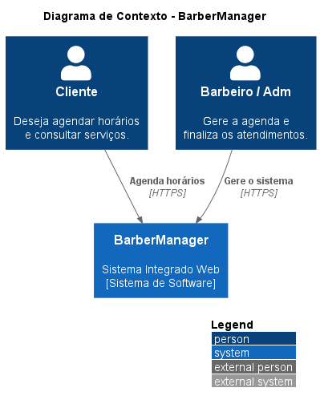
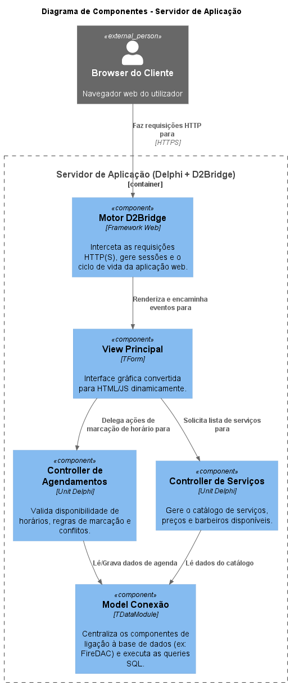
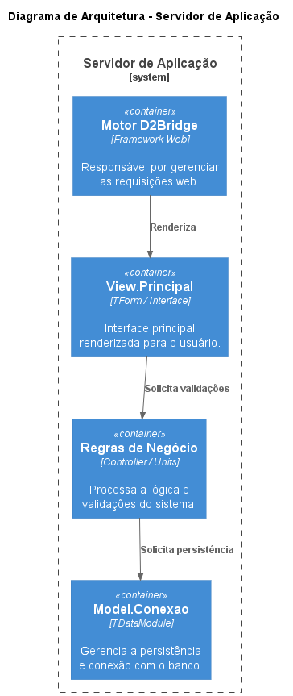
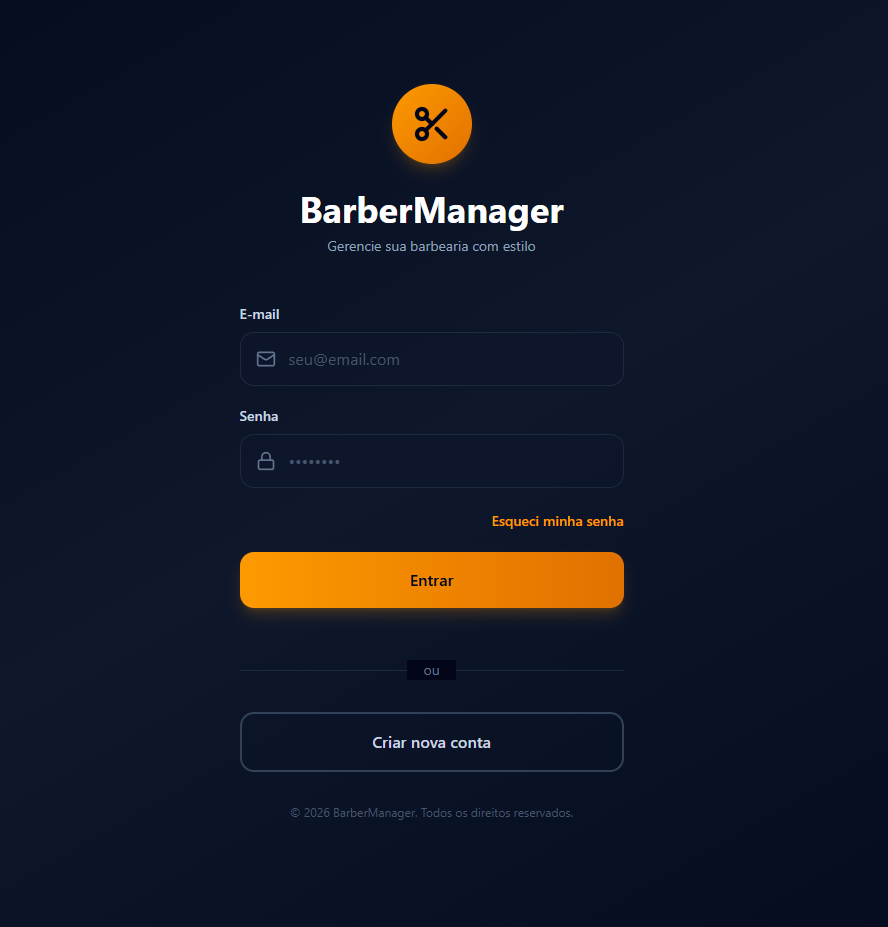
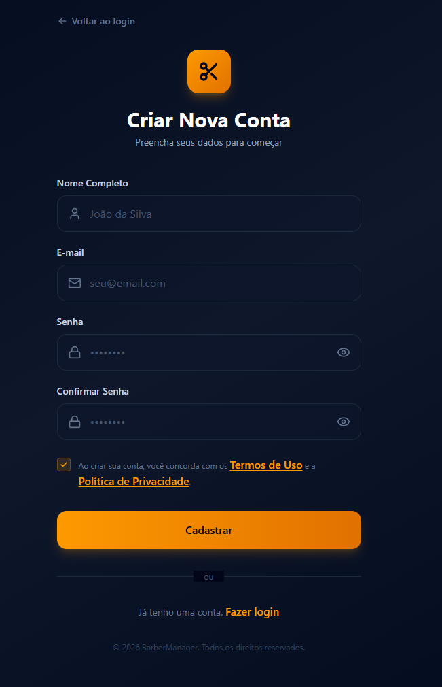
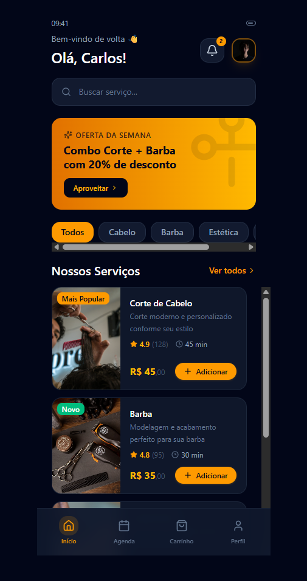
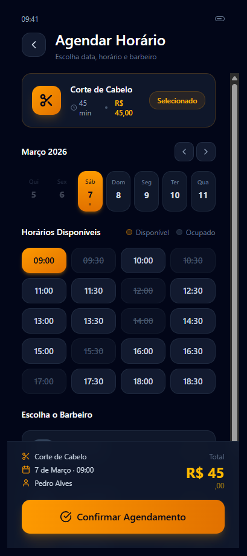
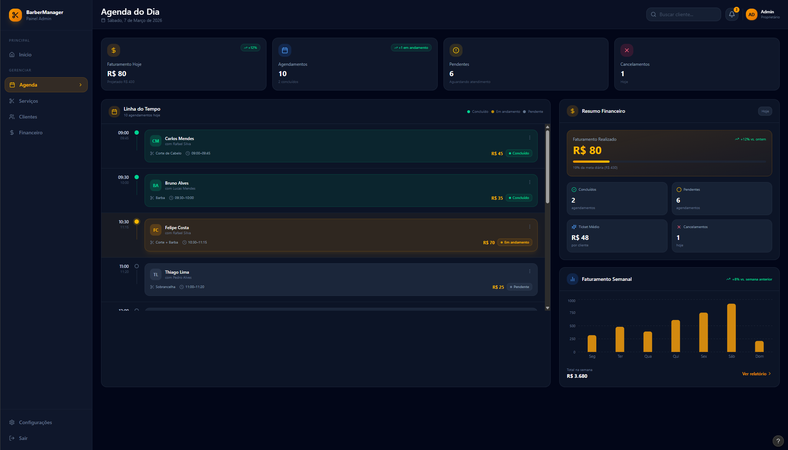
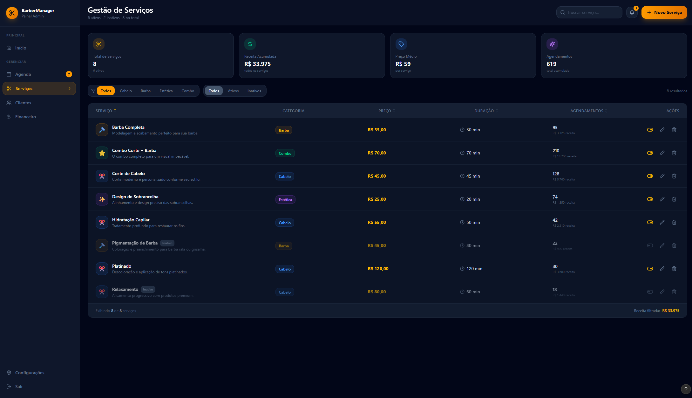

# BarberManager

**BarberManager** é um sistema completo e moderno para a gestão de barbearias, projetado para revolucionar a conexão entre barbeiros e clientes. O projeto visa eliminar o atrito dos agendamentos manuais e oferecer um controle financeiro e administrativo robusto para os proprietários.

> Este projeto é desenvolvido como requisito da disciplina de **Programação Web**, aplicando boas práticas de Engenharia de Software, UI/UX Design moderno e Arquitetura Limpa.

---

## Sumário

- [Visão Geral do Sistema](#visão-geral-do-sistema)
- [Arquitetura e Tecnologias](#arquitetura-e-tecnologias)
- [Diagramas de Arquitetura (C4 Model)](#diagramas-de-arquitetura-c4-model)
- [Telas e Navegação (Protótipo Interativo)](#telas-e-navegação-protótipo-interativo)
- [Módulos e Funcionalidades](#módulos-e-funcionalidades)
- [Estrutura do Repositório](#estrutura-do-repositório)
- [Próximos Passos (Roadmap)](#próximos-passos-roadmap)
- [Como Executar](#como-executar-o-protótipo)

---

## Visão Geral do Sistema

O sistema é dividido em dois universos distintos, compartilhando a mesma base de código (**Single Codebase**) graças ao poder do Delphi FMX:

- **App Mobile (Para Clientes):** Focado na experiência do utilizador (UX), permitindo cadastro ágil, escolha de serviços e agendamento de horários em poucos cliques.
- **Dashboard Web/Desktop (Para Administradores):** Um painel de controle de alta produtividade (resolução 1280x720) para os barbeiros gerirem a fila de espera, serviços oferecidos e a faturação diária.

---

## Arquitetura e Tecnologias

| Item | Detalhe |
|---|---|
| **Linguagem** | Delphi (Object Pascal) |
| **Framework de Interface** | FMX (FireMonkey) — compilação nativa para Windows, Android, iOS e Web |
| **Paradigma UI** | Single Page Application (SPA) com `TTabControl` (Mobile) e injeção de `TFrames` (Desktop) |
| **Modelagem** | C4 Model (Contexto, Componentes e Servidor) |
| **Base de Dados (Planeado)** | SQLite (Mobile) / Firebird ou MySQL (Servidor) |

---

## Diagramas de Arquitetura (C4 Model)

A arquitetura do sistema foi modelada seguindo o **C4 Model**, que descreve o software em diferentes níveis de abstração — do contexto geral até os componentes internos e a infraestrutura de servidor.

---

### Diagrama de Contexto

> Visão macro do sistema: mostra o BarberManager e como ele se relaciona com os atores externos (Cliente, Barbeiro/Admin) e sistemas de terceiros.



---

### Diagrama de Componentes

> Detalha os principais componentes internos da aplicação e suas responsabilidades, evidenciando a separação entre o universo Mobile (Cliente) e Desktop (Admin).



---

### Diagrama de Servidor

> Representa a infraestrutura de implantação planejada, incluindo a comunicação entre os clientes, o servidor de aplicação e a base de dados.



---

## Telas e Navegação (Protótipo Interativo)

Atualmente, o projeto encontra-se na fase de **Protótipo de Alta Fidelidade**, onde todas as telas foram desenhadas e a navegação (roteamento) está **100% funcional**, simulando a experiência final do utilizador.

---

### Universo Cliente — App Mobile

---

#### Tela 01 — Login

> Acesso seguro com design limpo e logo em destaque. Ponto de entrada principal do app mobile.



---

#### Tela 02 — Criar Nova Conta

> Formulário amigável de cadastro com ícones ilustrativos e identificação visual clara para novos utilizadores.



---

#### Tela 03 — Home do Cliente

> Carrossel de categorias de serviços, banners de ofertas em destaque e listagem de serviços disponíveis.



---

#### Tela 04 — Agendamento

> Motor de agendamento completo: calendário interativo, grelha de horários disponíveis via `FlowLayout` e tela de confirmação do pedido.



---

### Universo Administrador — Dashboard Web/Desktop

---

#### Tela 05 — Dashboard Administrativo

> Visão geral financeira com KPIs principais (Faturação, Ticket Médio, Agendamentos Pendentes) e Linha do Tempo da agenda do dia.



---

#### Tela 06 — Gestão de Serviços

> Catálogo dinâmico de serviços com filtros, contadores, e ações rápidas de edição e exclusão — construído com componentes nativos, sem dependências de terceiros.



---

> **Nota:** Para visualizar as imagens em alta resolução, acesse o diretório [`docs/Telas/`](docs/Telas/) neste repositório.

---

## Módulos e Funcionalidades

### Módulo Cliente *(Front-End Concluído)*

- [x] Autenticação (Login e Cadastro com ícones nos inputs)
- [x] Navegação por "Bottom Navigation" (Início, Agenda, Carrinho, Perfil)
- [x] Catálogo de Serviços com rolagem inteligente horizontal
- [x] Motor de Agendamento (Seleção intuitiva de Dia, Horário e Barbeiro)

### Módulo Barbeiro/Admin *(Front-End Concluído)*

- [x] Sidebar de Navegação responsiva
- [x] Cards de Resumo Financeiro (KPIs: Faturação, Ticket Médio, Pendentes)
- [x] Linha do Tempo (Agenda do Dia) com avatares e status de serviço
- [x] Tela de Gestão de Serviços (Tabela de dados customizada sem componentes de terceiros)

---

## Estrutura do Repositório

```
BarberManager
 ┣ docs
 ┃ ┣ Diagramas_C4       # Diagramas C4 Model da arquitetura (.png)
 ┃ ┗ Telas              # Prints das telas de UI/UX aprovadas (.png)
 ┣ src                  # Código-fonte Delphi (.pas, .fmx)
 ┃ ┣ View.Principal.pas          # Casca do App Mobile e Navegação
 ┃ ┣ View.DashboardAdmin.pas     # Painel principal do Admin
 ┃ ┗ View.Frame.Servicos.pas     # Frame injetável de Serviços
 ┗ README.md            # Esta documentação
```

---

## Próximos Passos (Roadmap)

A metodologia de desenvolvimento adotada separa estritamente o **Front-end** do **Back-end**. Os próximos passos são:

- [x] **Fase 1:** Definição de Escopo e Requisitos
- [x] **Fase 2:** Design System e Protótipos no Figma
- [x] **Fase 3:** Construção do Front-End (UI) no Delphi FMX
- [x] **Fase 4:** Navegação, Transições e UX interativa (Mockups)
- [ ] **Fase 5:** Modelagem da Base de Dados Relacional (DER)
- [ ] **Fase 6:** Criação do Back-End (Regras de Negócio e APIs)
- [ ] **Fase 7:** Integração Front × Back (Data Binding e Persistência)

---

## Como Executar o Protótipo

Para testar a interface e a navegação atual do sistema:

**1. Clone o repositório:**
```bash
git clone https://github.com/seu-usuario/BarberManager.git
```

**2.** Abra o arquivo `.dproj` no **Embarcadero Delphi** (Community Edition ou superior).

**3.** Defina a plataforma alvo como **Windows 32-bit** ou **Android** para visualizar a responsividade.

**4.** Pressione `F9` para executar.

---

### Navegação de Teste

| Ação | Resultado |
|---|---|
| Clicar em **"Criar Nova Conta"** | Transição em Slide para tela de cadastro |
| Clicar em **"Entrar"** | Acesso à Home do Cliente |
| Clicar na **Logo** na tela de Login | Acesso direto à área Administrativa (Desktop) |
| Menu lateral no Admin | Alterna entre **"Agenda"** e **"Serviços"** |

---

<p align="center">Desenvolvido como projeto acadêmico — Disciplina de Programação Web</p>
