# BarberManager

**BarberManager** é um sistema completo e moderno para a gestão de barbearias, com painel do cliente para agendamentos online e dashboard administrativo com KPIs, gestão de serviços, agenda, clientes e financeiro.

> Desenvolvido como projeto acadêmico da disciplina de **Programação Web**, aplicando Engenharia de Software, UI/UX Design moderno e Arquitetura em camadas.

---

## Sumário

- [Visão Geral](#visão-geral)
- [Arquitetura e Tecnologias](#arquitetura-e-tecnologias)
- [Funcionalidades](#funcionalidades)
- [Estrutura do Repositório](#estrutura-do-repositório)
- [Diagramas de Arquitetura](#diagramas-de-arquitetura-c4-model)
- [Telas](#telas-e-navegação)
- [Como Executar](#como-executar)
- [Roadmap](#roadmap)

---

## Visão Geral

O sistema é composto por duas camadas independentes que partilham a mesma base de dados Firebird:

- **App Nativo (Delphi FMX):** App mobile/desktop compilado nativamente para Windows. Painel do cliente e dashboard do administrador.
- **Web App (Horse REST + HTML/CSS/JS):** Servidor REST em Object Pascal (Horse framework) na porta 9000. Frontend em HTML/CSS/JS puro servido pelo mesmo processo — sem CORS, sem dependências externas.

---

## Arquitetura e Tecnologias

| Item | Detalhe |
|---|---|
| **Linguagem** | Delphi 12 (Object Pascal) |
| **App nativo** | FMX (FireMonkey) — Windows, Android, iOS |
| **REST API** | Horse framework — servidor HTTP porta 9000 |
| **Frontend Web** | HTML/CSS/JS puro — SPA single-file (`index.html`) |
| **Base de Dados** | Firebird 3.0 (protocolo Local, `fbclient.dll`) |
| **Acesso a Dados** | FireDAC — conexão per-request na API; singleton no app nativo |
| **Segurança** | SHA-256 uppercase (`THashSHA2`) para passwords |
| **Paradigma UI** | SPA com secções via `display` toggle; drawer mobile hamburger |

---

## Funcionalidades

### Área do Cliente
- [x] Login e cadastro com hash SHA-256 e validação na BD
- [x] Catálogo de serviços carregado dinamicamente com filtros de categoria e busca
- [x] Motor de agendamento completo: calendário interativo, seleção de barbeiro e horário
- [x] Meus Agendamentos com badges de status coloridos
- [x] Avaliação de serviço concluído (1-5 estrelas + comentário)
- [x] Perfil editável: nome, email, telefone, senha
- [x] Notificações de agendamentos
- [x] Layout responsivo com hamburger drawer no mobile (≤768px)
- [x] Logout com limpeza de sessão

### Área do Administrador
- [x] Dashboard com KPIs do dia: faturamento, total, pendentes, cancelamentos, ticket médio
- [x] Linha do tempo de agendamentos com busca e navegação por data (← →)
- [x] Gráfico de faturamento semanal dinâmico
- [x] Relatório semanal detalhado por dia
- [x] Resumo financeiro com comparação vs. dia anterior
- [x] Gestão de Serviços: CRUD completo (criar, editar, toggle ativo/inativo, deletar)
- [x] Gestão de Agenda: filtros por status, alteração de status por linha
- [x] Gestão de Clientes: lista, toggle ativo/inativo, busca
- [x] Relatório Financeiro mensal com KPIs e gráfico diário
- [x] Configurações da barbearia (nome, meta, horário, telefone, endereço)
- [x] Notificações de avaliações recentes com badge persistente (localStorage)
- [x] Auto-update de status: PENDENTE→EM_ANDAMENTO→CONCLUIDO baseado no horário atual

### REST API (porta 9000)
| Método | Rota | Descrição |
|--------|------|-----------|
| POST | `/api/auth/login` | Login — retorna `{id, nome, email, perfil}` |
| POST | `/api/auth/cadastro` | Cadastro de cliente |
| GET | `/api/dashboard/kpis` | KPIs do dia (faturamento, total, status counts) |
| GET | `/api/dashboard/timeline` | Linha do tempo de agendamentos |
| GET | `/api/financeiro` | Relatório mensal com detalhes por dia |
| GET/POST | `/api/agendamentos` | Listar (com filtros) / criar agendamento |
| PUT | `/api/agendamentos/:id/status` | Alterar status do agendamento |
| GET | `/api/servicos` | Listar serviços (filtros: ativo, categoria, busca) |
| POST | `/api/servicos` | Criar serviço |
| PUT | `/api/servicos/:id` | Atualizar serviço |
| DELETE | `/api/servicos/:id` | Remover serviço |
| PUT | `/api/servicos/:id/toggle` | Toggle ativo/inativo |
| GET | `/api/clientes` | Listar clientes com busca |
| PUT | `/api/clientes/:id/toggle` | Toggle ativo/inativo de cliente |
| GET | `/api/barbeiros` | Listar barbeiros |
| GET | `/api/avaliacoes/recentes` | Últimas 10 avaliações |
| GET | `/api/avaliacoes/barbeiro/:id` | Avaliações de um barbeiro |
| GET | `/api/avaliacoes/cliente/:id` | Avaliações de um cliente |
| POST | `/api/avaliacoes` | Registar avaliação |
| GET | `/api/usuarios/:id` | Perfil do utilizador (incl. telefone) |
| PUT | `/api/usuarios/:id` | Atualizar perfil (nome, email, telefone, senha) |

---

## Estrutura do Repositório

```
BarberManager/
├── database/
│   └── BARBERMANAGER.FDB          # Base de dados Firebird 3.0
├── docs/
│   ├── Diagramas_C4/              # Diagramas C4 Model (.png)
│   └── Telas_Web/                 # Screenshots do Web App (.png)
├── src/
│   ├── API/                       # Handlers Horse REST API
│   │   ├── API.Conexao.pas        # CreateConnection per-request
│   │   ├── API.Auth.pas           # Login e cadastro
│   │   ├── API.Agendamentos.pas   # CRUD agendamentos + AutoAtualizarStatus
│   │   ├── API.Avaliacoes.pas     # Avaliações de serviço
│   │   ├── API.Barbeiros.pas      # Listagem de barbeiros
│   │   ├── API.Clientes.pas       # Gestão de clientes
│   │   ├── API.Dashboard.pas      # KPIs, timeline, financeiro
│   │   ├── API.Servicos.pas       # CRUD serviços
│   │   └── API.Usuarios.pas       # Perfil editável GET+PUT
│   ├── Model/
│   │   └── Model.Conexao.pas      # DataModule FireDAC (app nativo)
│   ├── View/
│   │   ├── View.Principal.pas     # App nativo — Login, Home, Agendamento
│   │   ├── View.DashboardAdmin.pas# Dashboard admin nativo
│   │   ├── View.Frame.Servicos.pas
│   │   ├── View.Frame.Agenda.pas
│   │   ├── View.Frame.Clientes.pas
│   │   ├── View.Frame.Financeiro.pas
│   │   └── View.Frame.Configuracoes.pas
│   └── Web/
│       └── index.html             # SPA: login + admin + cliente (fonte)
├── BarberManagerAPI.dpr           # Projecto Horse REST API
├── BarberManagerAPI.exe           # Servidor API compilado (porta 9000)
├── BarberManager.dproj            # Projecto app nativo FMX
├── cloudflared.exe                # Cloudflare Tunnel — expõe porta 9000 publicamente
├── start-barbermanager.ps1        # Script de arranque automático (dois terminais)
├── index.html                     # Cópia servida pelo .exe em GET /
├── CLAUDE.md                      # Contexto técnico para IA
└── README.md                      # Esta documentação
```

---

## Diagramas de Arquitetura (C4 Model)

### Diagrama de Contexto
> Visão macro: BarberManager e os atores externos (Cliente, Barbeiro/Admin).

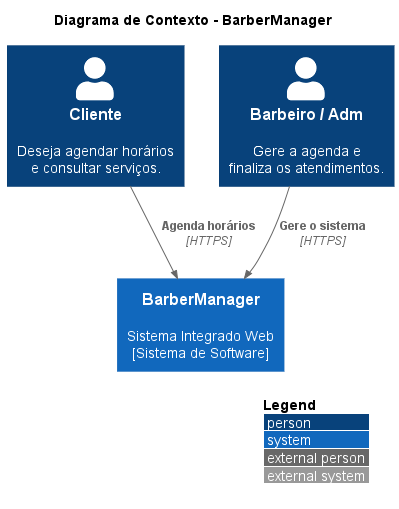

---

### Diagrama de Componentes
> Componentes internos — separação entre universo Mobile (Cliente) e Web/Desktop (Admin).

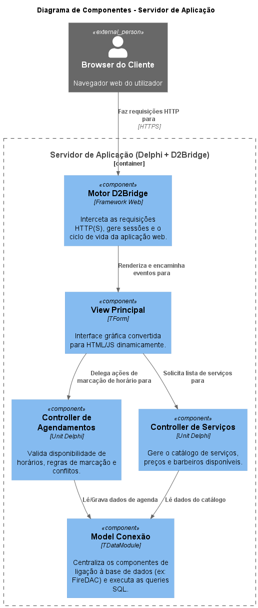

---

### Diagrama de Servidor
> Infraestrutura: clientes → servidor Horse (porta 9000) → Firebird 3.0 local.

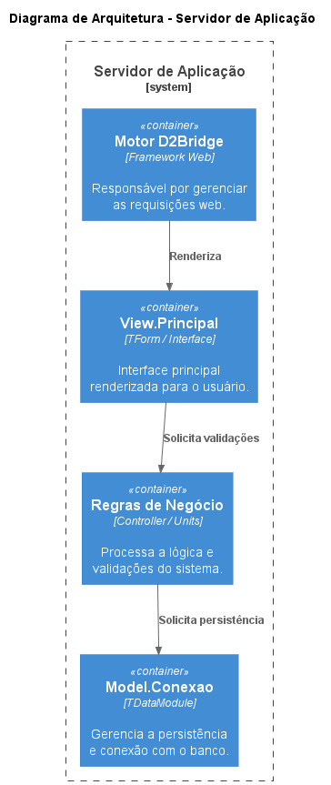

---

## Telas e Navegação

### Área do Cliente

#### Login
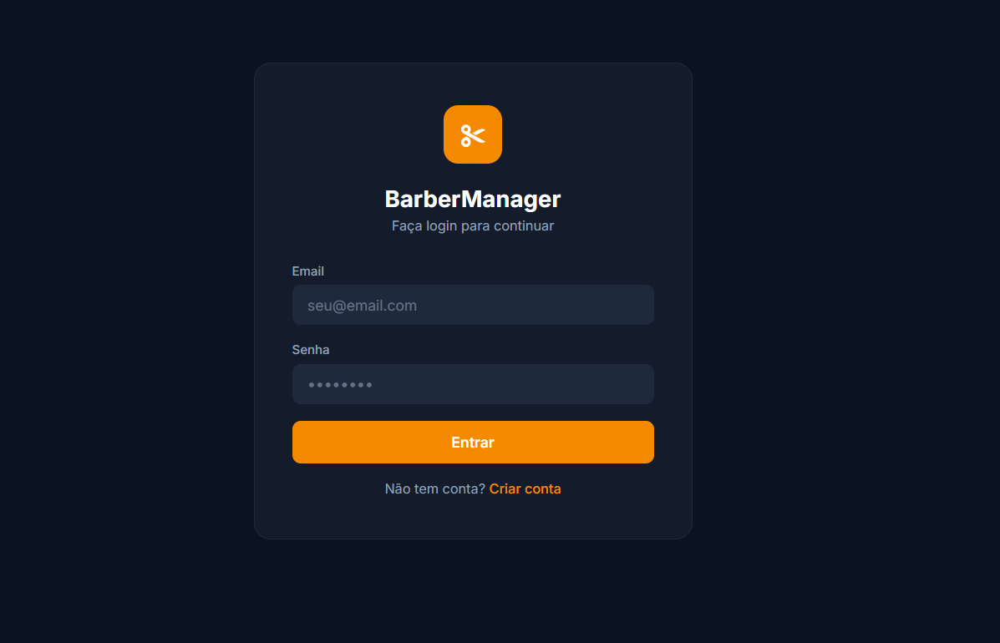

#### Criar Nova Conta
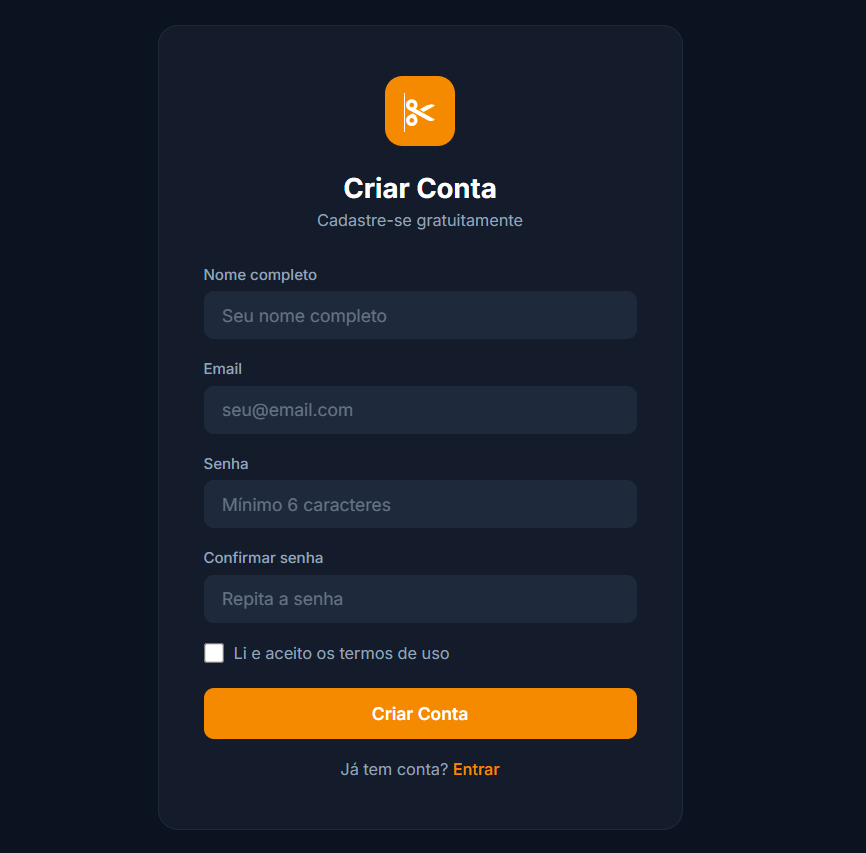

#### Catálogo de Serviços
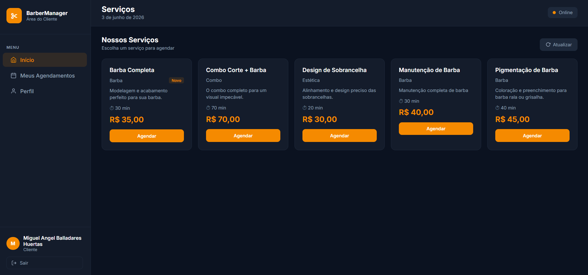

#### Agendamento (Modal 5 passos)
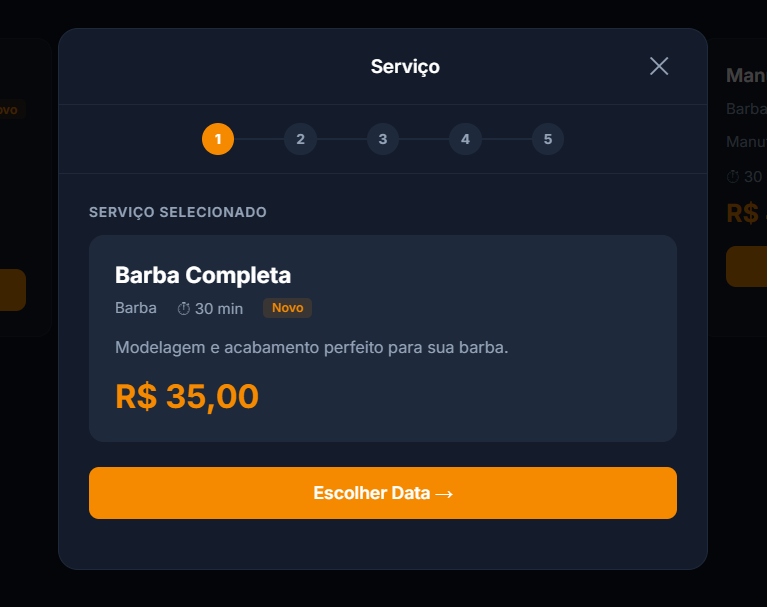

#### Meus Agendamentos
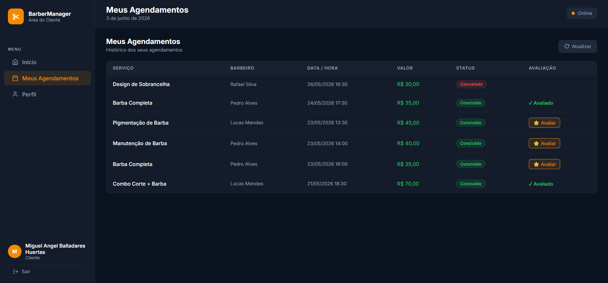

#### Meu Perfil
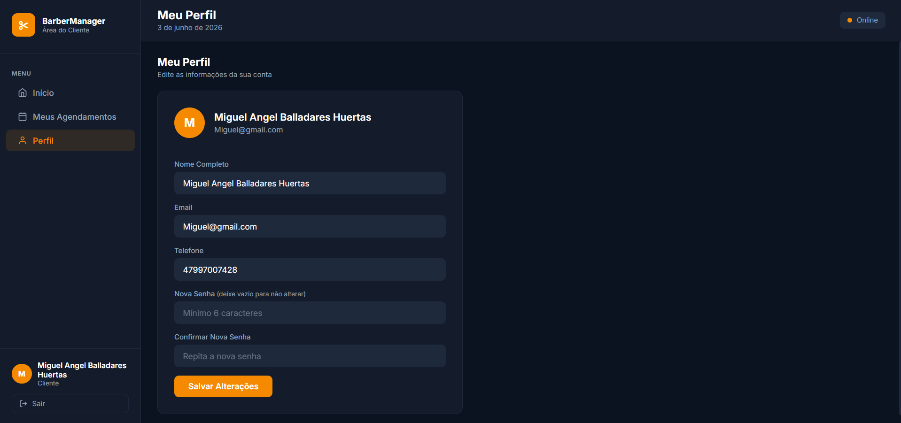

### Área do Administrador

#### Dashboard — KPIs e Linha do Tempo
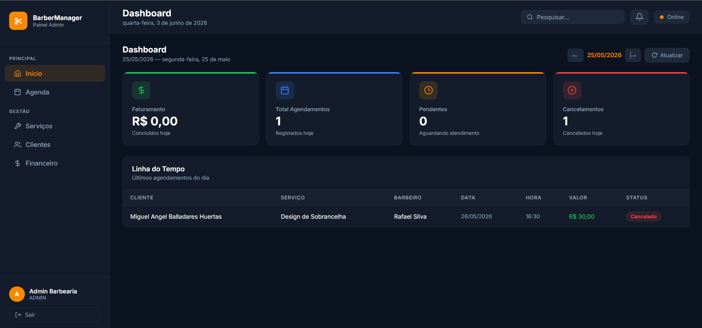

#### Gestão de Serviços
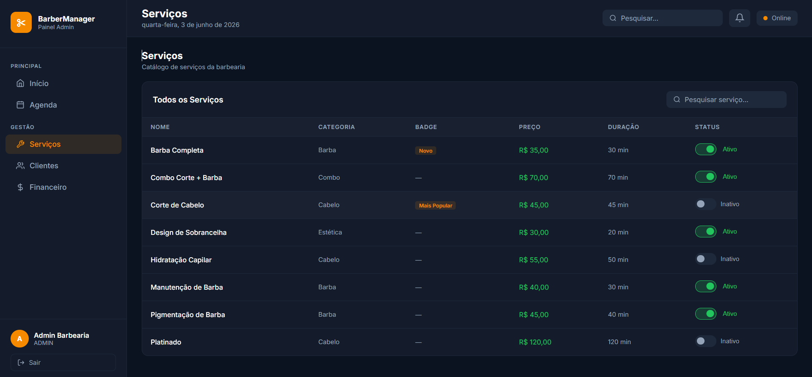

#### Agenda
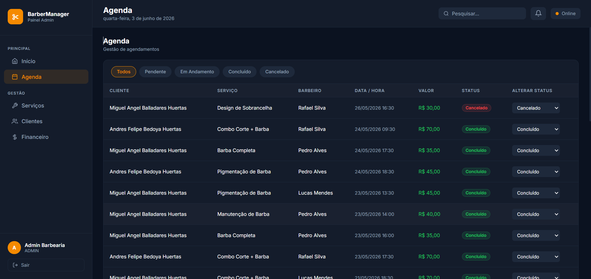

#### Clientes
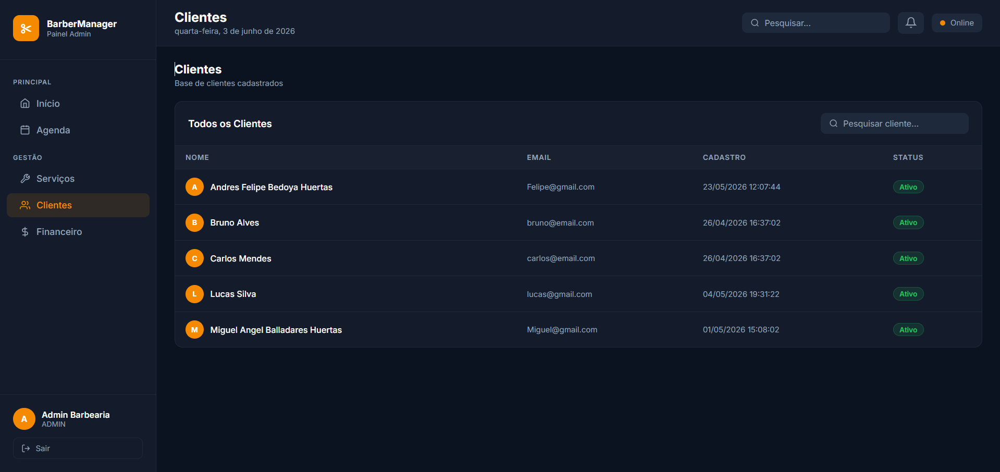

#### Financeiro
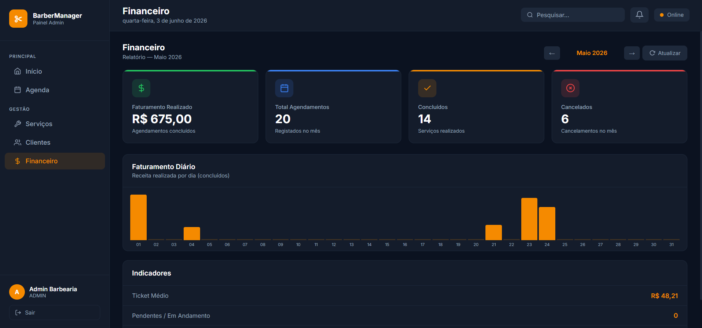

---

## Como Executar

### Pré-requisitos

| Requisito | Versão / Detalhe |
|---|---|
| **Delphi** | 12 Athens (Community Edition ou superior) |
| **Firebird** | 3.0 — [download](https://firebirdsql.org/en/firebird-3-0/) |
| **fbclient.dll** | Incluída na instalação (`Firebird_3_0\fbclient.dll`) |
| **Horse framework** | Instalado em `C:\Horse\horse-master\src` |

---

### Opção A — App Nativo (Delphi FMX)

**1. Clone o repositório**
```bash
git clone https://github.com/miguettohuertas/BarberManager.git
```

**2. Verifique o caminho da BD** em `src\Model\Model.Conexao.pas`:
```pascal
FDConnection1.Params.Database :=
  'C:\ProjetosDelphi\BarberManager\BarberManager\database\barbermanager.fdb';
```

**3. Compile e execute** — abra `BarberManager.dproj` no Delphi 12, plataforma **Windows 32-bit**, pressione `F9`.

---

### Opção B — Web App local (Horse REST API)

**1. Aplique as migrations da BD** (se ainda não aplicadas):
```sql
-- Executar no IBExpert ou isql com Charset=UTF8
ALTER TABLE TB_USUARIOS ADD DT_CADASTRO TIMESTAMP DEFAULT CURRENT_TIMESTAMP;
ALTER TABLE TB_USUARIOS ADD TELEFONE VARCHAR(20);
```

**2. Compile o projeto API** — abra `BarberManagerAPI.dproj` no Delphi 12, plataforma **Windows 32-bit**, compile (`Ctrl+F9`).

**3. Certifique-se de que `index.html` está na mesma pasta do `.exe`:**
```bash
# Se alterou src/Web/index.html, copie para a raiz:
cp src/Web/index.html index.html
# O post-build MSBuild também copia automaticamente para Win32\Debug\
```

**4. Execute** `BarberManagerAPI.exe` — verá no console:
```
BarberManager API running on http://localhost:9000
Press Enter to stop...
```

**5. Abra o browser** em `http://localhost:9000`

---

### Opção C — Deploy público via Cloudflare Tunnel ← recomendado

O sistema inclui `cloudflared.exe` para expor a API publicamente sem servidor dedicado, IP fixo ou abertura de portas.

**Arranque automático (recomendado):**
```powershell
.\start-barbermanager.ps1
```
Abre dois terminais PowerShell: um com a API Horse e outro com o túnel Cloudflare.

**Arranque manual (dois terminais):**
```powershell
# Terminal 1 — API
.\BarberManagerAPI.exe

# Terminal 2 — Túnel Cloudflare
.\cloudflared.exe tunnel --url http://localhost:9000
```

O terminal do `cloudflared` mostrará a URL pública:
```
Your quick Tunnel has been created! Visit it at (it may take some seconds to start up):
https://xxxx-xxxx-xxxx.trycloudflare.com
```

> **Nota:** A URL `trycloudflare.com` é temporária e muda a cada reinício. Para URL permanente é necessário criar um túnel nomeado com conta Cloudflare gratuita.

---

### Credenciais de Teste

| Perfil | E-mail | Password | Acesso |
|---|---|---|---|
| **Administrador** | `admin@barber.com` | `123456` | Dashboard Admin completo |
| **Cliente** | `carlos@email.com` | `123456` | Área do cliente + agendamento |

---

### Navegação de Teste (Web App)

| Ação | Resultado |
|---|---|
| Login como **Cliente** | Catálogo de serviços com filtros e busca |
| **Agendar** → selecionar serviço, barbeiro, data, hora | Agendamento persistido na BD |
| **Meus Agendamentos** | Lista real do cliente com badges de status |
| Clicar em agendamento CONCLUIDO | Abre modal de avaliação (estrelas + comentário) |
| **Meu Perfil** | Formulário editável com nome, email, telefone, senha |
| Login como **Admin** | Dashboard com KPIs e linha do tempo do dia |
| Admin → **← →** nas datas | Navega entre dias; KPIs e timeline atualizam |
| Admin → **Serviços** | CRUD completo com filtros, editar, toggle, deletar |
| Admin → **Agenda** | Lista de agendamentos com ComboBox de status por linha |
| Admin → **Clientes** | Lista com toggle ativo/inativo e busca |
| Admin → **Financeiro** | Relatório mensal com KPIs e gráfico diário |
| Admin → **Configurações** | Leitura e escrita em TB_CONFIGURACOES |
| Sino de notificações (Admin) | Badge conta avaliações novas desde última abertura |

---

## Roadmap

| Fase | Descrição | Estado |
|---|---|---|
| **Fase 1** | Definição de Escopo e Requisitos | ✅ Concluído |
| **Fase 2** | Design System e Protótipos | ✅ Concluído |
| **Fase 3** | Construção do Front-End FMX (UI) | ✅ Concluído |
| **Fase 4** | Navegação, Transições e UX | ✅ Concluído |
| **Fase 5** | Modelagem da BD (DER + schema Firebird) | ✅ Concluído |
| **Fase 6** | Back-End — Conexão, Login, KPIs, Agendamento | ✅ Concluído |
| **Fase 7** | Integração Front × Back — App nativo + Web App | ✅ Concluído |
| **Fase 8** | Web App completo (Horse REST + HTML/CSS/JS) — local | ✅ Concluído |
| **Fase 9** | Deploy público via Cloudflare Tunnel | ✅ Concluído |

---

<p align="center">Desenvolvido como projeto acadêmico — Disciplina de Programação Web</p>
